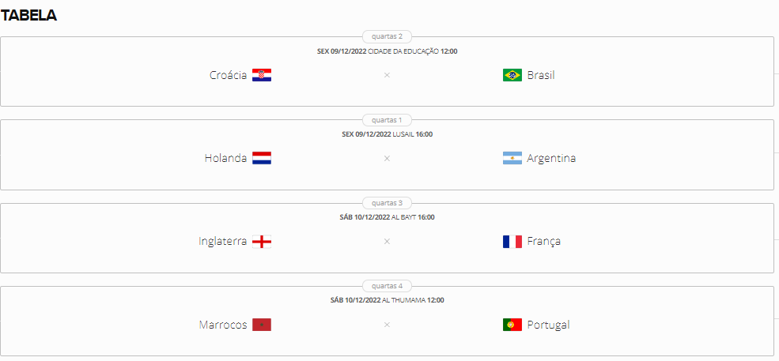

<h1 align="center">


<h3> <p align="center"> Quarter Finals Simulation  </p> </h3>
<h3> <p align="center"> ================= </p> </h3>

>> <h3> Desc </h3>




>> <h3> Description </h3>

<p> Just a joke to simulate which team will be champion of the 2022 world cup </p>

>> <h3> How to Run </h3>

in your terminal (linux ou mac) run:

```
source start.sh

```

>> <h3> Sample </h3>

```
-*--*--*--*--*--*--*--*--*--*--*--*--*--*--*--*--*--*--*--*-
SIMULADOR FINAL DA COPA DO MUNDO

-*--*--*--*--*--*--*--*--*--*--*--*--*--*--*--*--*--*--*--*-

SELEÇÕES PARTICIPANTES
-*--*--*--*--*--*--*--*--*--*--*--*--*--*--*--*--*--*--*--*-
CHAVE 1:
BRASIL vs CROACIA
-*--*--*--*--*--*--*--*--*--*--*--*--*--*--*--*--*--*--*--*-
CHAVE 2:
HOLANDA vs ARGENTINA
-*--*--*--*--*--*--*--*--*--*--*--*--*--*--*--*--*--*--*--*-
CHAVE 3:
INGLATERRA vs FRANCA
-*--*--*--*--*--*--*--*--*--*--*--*--*--*--*--*--*--*--*--*-
CHAVE 4:
MARROCOS vs PORTUGAL
-*--*--*--*--*--*--*--*--*--*--*--*--*--*--*--*--*--*--*--*-

JOGO 1

-PLACAR-

BRASIL (1) vs (3) CROACIA

Vitoria de CROACIA 

---------------------------------------------------------------------------

JOGO 2

-PLACAR-

HOLANDA (3) vs (2) ARGENTINA

Vitoria de HOLANDA 

---------------------------------------------------------------------------

JOGO 3

-PLACAR-

INGLATERRA (6) vs (4) FRANCA

Vitoria de INGLATERRA 

---------------------------------------------------------------------------

JOGO 4

-PLACAR-

MARROCOS (2) vs (4) PORTUGAL

Vitoria de FRANCA 

---------------------------------------------------------------------------


    SEMIFINALISTAS
    CHAVE 1:
    CROACIA vs HOLANDA

    CHAVE 2:
    INGLATERRA vs PORTUGAL
    
-PLACAR-

CROACIA (6) vs (1) HOLANDA

Vitoria de CROACIA 

---------------------------------------------------------------------------

-PLACAR-

INGLATERRA (6) vs (1) PORTUGAL

Vitoria de INGLATERRA 

---------------------------------------------------------------------------


    FINALISTAS
    CROACIA vs INGLATERRA

    DECISÃO DE TERCEIRO LUGAR:
    HOLANDA vs PORTUGAL
    
-PLACAR-

CROACIA (0) vs (4) INGLATERRA

---------------------------------------------------------------------------

O CAMPEÃO É INGLATERRA 

O VICE CAMPEÃO É CROACIA 

---------------------------------------------------------------------------

-PLACAR-

HOLANDA (2) vs (0) PORTUGAL

---------------------------------------------------------------------------

O TERCEIRO LUGAR É HOLANDA 

O QUARTO LUGAR É PORTUGAL 

---------------------------------------------------------------------------


```